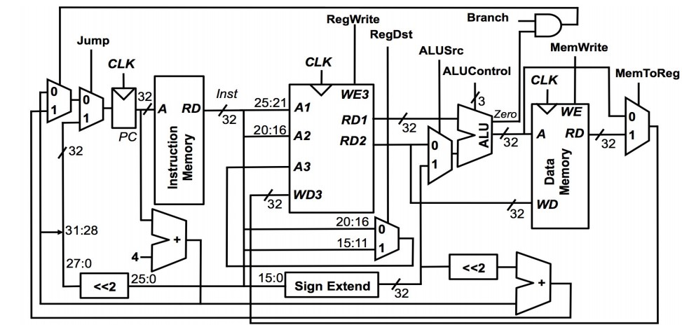

# logisimcpu
Create a 32bit CPU(single cycle CPU) by logisim... Course Computer Architecture Spring 2017 ILAM university ..Instructor : Dr. M. Bag-Mohammadi http://dir.ilam.ac.ir/mozafar/ca

ALU-Arithmetic logic unit
========================

This unit has two 32-bit inputs A and B and a 32-bit output called Y. 3-bit input F determines the ALU function. The single-digit Zero output also specifies whether Y is equal to zero. The ALU performance is as shown in the following table

| Function  | F |
| ------------- | ------------- |
| A AND B  | 000  |
| A OR B  | 001  |
| A + B | 010 |
| If (A<B) Y=1 Else Y=0 | 111|

REG File 
========================

The bank has 8 32-bit registers. The first register value is always zero. The inputs for this module are as follows

| REG FILE |
| ------------- |
| Read Register 1 (3 bits)|
| Read Register 2 (3 bits)|
| Write Register (3 bits)|
| write data (32 bits)|
| RegWrite (1 bit)|
| clk (1 bit)|

CPU
========================
Datapath 

ISA
========================

The instructions for this processor are 32-bit. In addition, the processor addresses are 32-bit. So, we consider the instructional and data memory size to be 8 bits (quite similar to the book). For example, we mean the address 00000008 of the 8th, 9th, 10th and 11th houses of memory, with a 32-bit word. The structure of the instructions is given in the table below. Note that all R-type commands have zero-code and are characterized by their 3-bit low value:

 |  31-26 | 25-21 |	 20-16 |	 15-11 |	10-3 |	2-0 | Command |
 |------|-------|-------|-------|------|------|--------- |
 |0|rs  |	rt    |	rd    |	        Unused |	funct  |	R-format |
|1|rs|	rt|	| | |	addi rt rs imm ;$rt = $rs + imm|  
|2|rs|	rt||||	  ori rt rs imm|
|3|	rs|	rt||||andi rt rs imm.| 
|4||||||	                           target address	Jump To target|
|5|	rs|	rt||||	offset (signed)	beq|
|6|	rs|	rt||||	immediate (signed)	lw rt imm(rs) $rt = MEM[$rs + imm]|
|7|	rs|	rt||||	immediate (signed)	sw rt imm(rs)   MEM[$rs+imm] = $rt|
 
 The 4 bits of the jump address are obtained from PC 4. In the beq statement, the offset value is considered relative and flagged and multiplied by 4. It also comes with PC + 4. Note that the field is a 16-bit field field. Therefore, it is necessary to be expanded before sending to the ALU. In places where immediate is asymptomatic, you must add 16 zeros. In places where the symbol is immediate, it must be expanded according to the symbol.

RAM 
========================

Since the RAM module is not like an ideal memory, it may be difficult to use it. The above figure shows how to use RAM.
• This input determines whether the memory is active or not.
• Input A specifies the address from the memory.
• Clr input places all memory elements to 0.
• The input ld specifies whether we want to write in memory or read data from memory. If ld is one, output will be equal to the memory contents in home A. If ld is zero, then the data D is written to the home in memory A.
• Port D acts both as inputs and as outputs. Using a three-way buffer, there's no conflict between DataIn and DataOut.
• You can use the poke tool to change the memory contents. Also, you can right-click on the memory and select Load Image to load the memory values ​​from a file.

